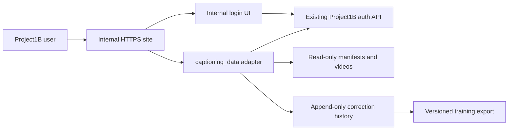

# Using captioning_data with Project1B

This guide covers access, production installation, account roles, video assignments, caption review, and training exports. Commands below describe future production operations; they have **not** been run against the live Project1B database or site.

The local QA deployment at `https://100.89.98.89:9445/` is stopped. Its ignored `.preview/` directory retains the mock database and correction history. The QA branch is `caption_data-qa`.

## 1. What is integrated

The internal website serves two entry points:

- `https://internal.project1b.space/`: Project1B login, a captioning_data link, and the admin recording library.
- `https://internal.project1b.space/captioning_data/`: dataset video playback and caption review.

Add a **captioning_data** navigation link pointing to the second URL in the main Project1B frontend when releasing the integration. This repository does not modify the main site's frontend or mount the route at `https://project1b.space/captioning_data/`.



Nginx proxies the existing authentication API at `127.0.0.1:8903`. The caption adapter listens at `127.0.0.1:8325`; it validates the Project1B session on every protected request. Neither upstream should be exposed publicly.

The viewer UI/backend are pinned in `viewer/`. `viewer/SOURCE_SNAPSHOT.json` identifies the source checkout baseline, working-tree snapshot, and file checksums. Imported caption/video helpers are reused from the VR-finetune-VLM deployment checkout and snapshotted privately during installation. Unrelated model-pipeline modules, dataset manifests, videos, passwords, mock state, and real account lists are not published in this repository.

## 2. Access and sign-in

1. Open `https://internal.project1b.space/captioning_data/` after production installation.
2. If prompted, sign in using an existing, active Project1B account.
3. The internal login UI calls Project1B's real `/api/auth/web/login` endpoint. Successful login returns to captioning_data; sample links retain their sample hash.
4. Choose a sample and inspect its video and captions.

**This is the internal site's login page, backed by Project1B authentication. It is not the main Project1B login page.** Accounts and role grants come from the same production database, but the secure `__Host-rbt_session` cookie is host-only. A session on `project1b.space` does not automatically sign the user into `internal.project1b.space`. Users sign in on the internal hostname as well. No shared-cookie or SSO redirect flow is implemented.

The password previously discussed for a single administrator is not configured. Production retains existing Project1B accounts, passwords, and authority assignment.

If a session expires while editing, keep the editor tab open. Use **Sign in in another tab**, complete login on the internal hostname, then click **Resume session** and save. Unsaved drafts remain in the open editor; they are not durable until Save succeeds and may be lost if the tab is closed or refreshed.

### Current permissions

- Every authenticated Project1B user can view, edit, save, and reset every caption sample.
- `caption_data_reviewer` identifies a caption reviewer in the viewer.
- `caption_data_admin` identifies a caption administrator in the viewer. It does not grant Project1B account-management or recording-library access.
- Existing Project1B `admin` grants still permit account role management and the internal recording library.
- Assignment labels and filters organize workload; they do not enforce access restrictions.

Caption administrator and reviewer roles currently share the same caption editing permissions because access was explicitly requested for all authenticated users. There is no separate approval queue or administrator-only publish action. Removing a caption role alone does not remove caption access from an otherwise active authenticated account; use Project1B's account/session controls when access must be revoked.

## 3. Prepare production

Use the reviewed Project1B backend source checkout for backend changes. Do not patch files directly in a running release directory.

Required infrastructure:

- DNS and HTTPS for `internal.project1b.space`; the existing host's configured target is `211.26.247.72`. Confirm the actual deployment target before changing DNS.
- Nginx, certbot with the server's existing ACME account, systemd, and sudo on the deployment host.
- Python 3.10 or later with the viewer's existing `python-dotenv` dependency. No model server or GPU is required to serve the viewer.
- A VR-finetune-VLM checkout with the existing caption/video helper modules, `data/splits/train.jsonl`, `val.jsonl`, and `test.jsonl`, plus readable video files referenced by the manifests.
- A service user with read access to the manifests and videos, and write access to the correction state directory.
- An operational Project1B authentication API at `127.0.0.1:8903` with the web session/CSRF cookie contract.

On the current development server the example data root is `/home/tho2/VR-finetune-VLM`, Python is `/home/tho2/miniconda3/bin/python3`, and service user is `tho2`. Adjust these for another host. A fresh internal-site checkout still needs that dependency checkout; it does not need uncommitted changes to the dependency's dataset viewer because the reviewed UI/backend ship here.

Before release, back up the Project1B database and any existing caption history. The example database commands below use a PostgreSQL connection service named `project1b`. Configure that service and its password file privately first; it is a placeholder, not a credential supplied by this repository.

## 4. Update the Project1B database and backend

The new role names must be accepted by both PostgreSQL and the main Project1B backend. `deploy/install.sh` does **not** apply this migration or patch the main API.

### Back up and inspect the database

```bash
umask 077
mkdir -p /secure/project1b-backups
pg_dump --dbname='service=project1b' --format=custom \
  --file="/secure/project1b-backups/before-caption-roles-$(date -u +%Y%m%dT%H%M%SZ).dump"

psql 'service=project1b' -X -v ON_ERROR_STOP=1 -c \
  "SELECT pg_get_constraintdef(oid) FROM pg_constraint
   WHERE conrelid = 'user_roles'::regclass AND conname = 'ck_user_roles_role';"
```

If the current constraint already differs from the five-role baseline, reconcile the SQL and patch with that version first. Preserve any additional roles already introduced by another change.

### Patch the backend source

From the main Project1B source checkout, using the path to this repository:

```bash
git apply --check /path/to/project1B_internal/deploy/project1b-caption-roles.patch
git apply /path/to/project1B_internal/deploy/project1b-caption-roles.patch
```

The patch updates:

- `backend/models.py`: the `ck_user_roles_role` model constraint.
- `backend/routers/admin.py`: the `WorkerRole` request allowlist.

Commit those changes in the main Project1B repository and run its normal backend checks. The patch is a companion change; this internal-site PR does not automatically create or deploy a main-site backend PR.

### Apply the database migration, then release the backend

```bash
psql 'service=project1b' -X -v ON_ERROR_STOP=1 \
  -f /path/to/project1B_internal/deploy/caption_data_roles.sql

psql 'service=project1b' -X -v ON_ERROR_STOP=1 -c \
  "SELECT pg_get_constraintdef(oid) FROM pg_constraint
   WHERE conrelid = 'user_roles'::regclass AND conname = 'ck_user_roles_role';"
```

The migration runs in a transaction with a five-second lock timeout. It replaces the check constraint with the existing five roles plus `caption_data_admin` and `caption_data_reviewer`. It preserves users and existing grants. New roles are values in `user_roles.role`; production does not need the mock SQLite `roles` catalog table.

Deploy the patched backend through Project1B's normal release process. Apply the database expansion first, then release the matching API allowlist, then grant the new roles. Updating SQL alone leaves the old API returning validation errors for those names.

No caption table migration is required: captions and before/after history use a durable append-only log outside the application releases.

## 5. Install the internal route

From the reviewed `project1B_internal` checkout on the production host:

```bash
sudo DATASETS_REPO=/home/tho2/VR-finetune-VLM \
  DATASETS_PYTHON=/home/tho2/miniconda3/bin/python3 \
  DATASETS_USER=tho2 \
  bash deploy/install.sh
```

Here `DATASETS_REPO` selects the VR-finetune-VLM **data and helper-code root**. The installer copies the reviewed UI/backend from this repository's `viewer/` directory and snapshots the dependency checkout's imported helpers. Inside the installed systemd unit, the environment variable of the same name points Python imports at that installed helper snapshot; `--data-root` separately selects the actual dataset root.

The installer:

1. Copies frontend, adapter, and imported viewer code into `/var/www/project1b-internal/releases/`.
2. Creates or preserves `/var/lib/project1b-datasets/annotation_edits.jsonl` with private permissions.
3. Installs and starts `project1b-datasets.service` as the selected service user.
4. Checks the adapter's local health.
5. Obtains the separate internal-hostname certificate, installs its Nginx site, switches `current`, and reloads Nginx.
6. Verifies the expected HTTPS page is being served. On install failure it restores the previous internal release/configuration/service; correction history is preserved.

On first install only, an existing `DATASETS_REPO/data/annotation_edits.jsonl` seeds production history. Inspect that file before installation: mock or development edits should not silently become training corrections. Redeployment never replaces existing production history.

Verify after installation:

```bash
sudo systemctl status project1b-datasets.service --no-pager
curl --fail http://127.0.0.1:8325/healthz
sudo nginx -t
```

Then test in a browser with an ordinary Project1B account: login, playback, caption save, Before / after, reload, and logout. Confirm recording downloads remain restricted to Project1B `admin` accounts. Run any test edits on a designated QA sample and append a reset when finished; the audit history will retain those operations.

## 6. Assign caption reviewers and administrators

Use an existing Project1B **`admin`** account on the main Project1B site. The internal site's Nginx allowlist intentionally does not expose `/api/admin/...`.

Find the target account in Project1B's worker/account administration screen. Record its stable user UUID and current roles. Existing role-management UI may list only the original five role names; this companion patch updates the API allowlist, not that frontend selector. Use the authenticated API below until the main frontend supports the new choices.

`PUT /api/admin/workers/{worker_id}/roles` **replaces the complete role set**. Preserve unrelated grants. The following browser-console example first reads the current roles, then adds one caption role. Run it while signed in as an administrator on the main site's hostname, after reviewing the selected UUID and role:

```javascript
const workerId = 'REPLACE_WITH_PROJECT1B_USER_UUID';
const captionRole = 'caption_data_reviewer'; // or 'caption_data_admin'
const detailResponse = await fetch(`/api/admin/workers/${encodeURIComponent(workerId)}`, {
  credentials: 'same-origin', cache: 'no-store'
});
if (!detailResponse.ok) throw new Error(await detailResponse.text());
const account = await detailResponse.json();
const roles = [...new Set([...account.roles, captionRole])];
console.log({ user: account.username, before: account.roles, after: roles });
```

Inspect that output before running the mutation:

```javascript
const csrfCookie = document.cookie.split('; ')
  .find(value => value.startsWith('__Host-rbt_csrf='));
if (!csrfCookie) throw new Error('Sign in with a Project1B web session first');
const roleResponse = await fetch(`/api/admin/workers/${encodeURIComponent(workerId)}/roles`, {
  method: 'PUT', credentials: 'same-origin',
  headers: {
    'Content-Type': 'application/json',
    'X-CSRF-Token': decodeURIComponent(csrfCookie.slice(csrfCookie.indexOf('=') + 1))
  },
  body: JSON.stringify({ roles })
});
if (!roleResponse.ok) throw new Error(await roleResponse.text());
console.log(await roleResponse.json());
```

For removal, reread the current account and replace the `roles` construction with `account.roles.filter(role => role !== captionRole)`, then review and submit the complete set. Coordinate concurrent administrator changes; the API has replacement semantics.

The Project1B API records who changed the roles and invalidates the target account's sessions. Tell the user to sign in again on the internal site and confirm their roles with `/api/auth/me`. Editing `user_roles` directly bypasses those API audit/session controls, so use the API for ordinary grants and revocations.

Granting `caption_data_admin` does not turn a reviewer into a Project1B `admin`. Keep Project1B account-management authority separate from caption workload labels.

## 7. Assign and reassign videos

Two independent things must be configured:

1. **Account roles** in Project1B authentication determine the viewer's role label.
2. **Sample assignments** in data-root JSON files determine workload labels and filters.

Changing a role does not assign videos. Changing an assignment does not grant a role. This viewer reads prepared dataset samples, not Project1B's recording/cutting assignment tables, and offers no assignment-management page.

Files under the configured data root:

```text
data/egoverse/qa/roster.json
data/egoverse/qa/assignment.json
```

Example `roster.json`:

```json
{
  "reviewers": ["Reviewer One", "Reviewer Two"],
  "admins": ["Caption Lead"]
}
```

Example `assignment.json`:

```json
{
  "episodes": {
    "EgoVerse:train:egoverse/example-a": "Reviewer One",
    "EgoVerse:val:egoverse/example-b": "Reviewer Two"
  }
}
```

Assignment keys must match the viewer's full **`id`**, including dataset and split; do not use only the raw `episode_uid`, recording database ID, or video path. While signed in on the internal site, obtain valid IDs with:

```javascript
const sampleResponse = await fetch('/captioning_data/api/episodes', {
  credentials: 'same-origin', cache: 'no-store'
});
if (!sampleResponse.ok) throw new Error(await sampleResponse.text());
const samples = (await sampleResponse.json()).episodes;
console.table(samples.map(sample => ({
  id: sample.id, dataset: sample.dataset, split: sample.split, assignee: sample.assignee
})));
```

Names are display labels, not enforced stable account IDs. Use unique labels matching Project1B full names where possible, and update them if users change names. Include each assignee in the roster so the workload/progress panel can show them. The correction audit still uses authenticated stable user IDs, independently of assignment names.

### Create an initial automatic assignment

Create `roster.json` first. From the internal repository checkout, run:

```bash
python3 -B - <<'PY'
from pathlib import Path
from datasets_server import datasets

datasets.REPO = Path('/home/tho2/VR-finetune-VLM')
qa = datasets.REPO / datasets.QA_DIR
roster = datasets.read_json(qa / 'roster.json', {'reviewers': [], 'admins': []})
datasets.write_assignment(qa / 'assignment.json', datasets.load(datasets.SOURCES), roster)
PY
```

The existing helper assigns **EgoVerse samples only** using a deterministic shuffle: each reviewer gets two seats per round, each administrator one. It refuses to overwrite an existing assignment file. Do not delete an active assignment just to add a reviewer; update selected entries instead. For other datasets, explicitly map their valid viewer IDs in the same `episodes` object.

### Reassign selected samples

Back up both JSON files. Then use an atomic update; this example preserves unrelated assignments:

```bash
python3 -B - <<'PY'
import json
from pathlib import Path
from datasets_server import datasets

datasets.REPO = Path('/home/tho2/VR-finetune-VLM')
qa = datasets.REPO / datasets.QA_DIR
assignment = qa / 'assignment.json'
roster = datasets.read_json(qa / 'roster.json', {'reviewers': [], 'admins': []})
known_people = set(roster['reviewers'] + roster['admins'])
known_ids = {sample['id'] for sample in datasets.load(datasets.SOURCES)}
changes = {'REPLACE_WITH_EXACT_VIEWER_ID': 'Reviewer Two'}
assert set(changes) <= known_ids, 'Unknown sample ID'
assert set(changes.values()) <= known_people, 'Assignee missing from roster'
document = json.loads(assignment.read_text())
document.setdefault('episodes', {}).update(changes)
temporary = assignment.with_suffix('.json.next')
temporary.write_text(json.dumps(document, indent=2) + '\n')
temporary.replace(assignment)
PY

sudo systemctl restart project1b-datasets.service
```

Ask reviewers to save their drafts before restart. The adapter loads assignments and the roster at startup; refresh the browser after restart. Use the **QA assignee** filter or the progress panel to inspect one person's workload. Existing caption history remains associated with the sample, regardless of reassignment.

## 8. Review captions and inspect before/after

1. Filter samples by dataset, split, assignee, QA state, or search text.
2. Select a sample. Play the video and inspect instruction, sub-task, and atomic captions.
3. Edit caption text and cue timing. Use the existing add/remove controls where needed.
4. Open **Before / after** before saving. Default comparison is original versus current saved captions or unsaved draft.
5. Inspect removed words, added words, timing changes, and added/removed cues. **Show unchanged captions** includes the untouched parts. Timestamp buttons seek the video to either version's cue.
6. Click **Save** and wait for success. Reload to confirm the correction persisted.

Save without semantic changes marks a sample **confirmed**; a changed save marks it **corrected**. These are QA states, not separate administrator approvals.

For past fixes, select saved versions in the comparison. **Before selected change** uses the captions that reviewer started from. **Original captions** uses that revision's source baseline. Editor name and save time identify each revision. Comparison is read-only; choosing an old version does not restore it into the editor.

**Reset** appends a revert to the original captions. Previous saves remain in history and are inspectable. To recover an earlier correction as the active result, inspect that version, reapply its desired content in the current editor, and save a new version.

Concurrent saves return `409` rather than overwriting another reviewer's work. Preserve your intended text, reopen the sample to load its current version, reconcile the changes, then save. On mobile, opening comparison hides the episode list and stacks Before/After; use **☰ episodes** to reopen the list.

## 9. Safe storage and training export

Production correction history is:

```text
/var/lib/project1b-datasets/annotation_edits.jsonl
```

Each new save/reset records sample ID, source manifest, UTC time, version, authenticated editor ID/name/roles, source SHA-256, original captions, and immediately preceding captions. Saves include the complete corrected fields. The server appends and `fsync`s the log and its directory before reporting success. It holds one writer-process lock and serializes request writes. Reset retains old revisions.

This protects committed writes on the current filesystem; it does not replace a backup against disk loss. Arrange regular snapshots and copy verified packages to another storage system. No automatic backup schedule is installed by this PR.

### Export a durable snapshot

Run as the service user, with read access to its private history and write access to the backup destination. Example on the current server:

```bash
snapshot_name="production-$(date -u +%Y%m%dT%H%M%SZ)"
sudo -u tho2 env DATASETS_REPO=/var/www/project1b-internal/current/service \
  /home/tho2/miniconda3/bin/python3 -B \
  /var/www/project1b-internal/current/datasets_server.py \
  --data-root /home/tho2/VR-finetune-VLM \
  --edits /var/lib/project1b-datasets/annotation_edits.jsonl \
  --export "/mnt/SSD5/captioning_data-snapshots/$snapshot_name"
```

The destination must not already exist. Export takes a consistent committed history snapshot under a file lock, copies input manifests into a private temporary package, applies the latest non-reverted correction, syncs files, then publishes the directory atomically. It refuses corrupt history and changed sources with active source-pinned edits.

The package contains:

- `data/splits/train.jsonl`, `val.jsonl`, `test.jsonl`: full manifests with active corrections applied.
- `annotation_edits.jsonl`: the complete captured audit history, including resets.
- `snapshot.json`: creation time, source hashes, exported-file hashes, history count, and legacy records without source hashes.

Changed rows contain `before_edit`, `edited_by`, `edited_by_id`, `edited_at`, and `edit_version`. Reset samples use source captions again. Export includes unchanged samples too; inspect QA coverage and your train/val/test policy before training. Video files are referenced, not copied into the snapshot.

Verify all output hashes before copying the package or training:

```bash
python3 -B - /path/to/exported-snapshot <<'PY'
import hashlib, json, sys
from pathlib import Path
root = Path(sys.argv[1])
metadata = json.loads((root / 'snapshot.json').read_text())
for relative, expected in metadata['file_sha256'].items():
    actual = hashlib.sha256((root / relative).read_bytes()).hexdigest()
    assert actual == expected, relative
print('Snapshot checksums verified')
PY
```

Point training at the exported split manifests, retaining the package and accessible video roots. Never train directly from a log that is still being written. Imported legacy history without source hashes/snapshots requires manual review before training; `snapshot.json` reports the hashless record count.

## 10. Add or update source videos

Uploading a Project1B recording does not automatically add it to captioning_data. Prepare the dataset video and its manifest row through the data-preparation pipeline, then install that row in the appropriate split manifest.

A typical row provides `episode_uid`, `dataset`, `split`, `video`, `duration_s`, `instruction`, `subtask`, and `caption`. Cue values use the existing viewer's supported formats. Keep IDs unique and stable. Use actual playable video paths accessible to the service user; subtitle times must refer to that sample's video. Do not treat changing an assignment as changing a source video.

The adapter loads manifests at startup and pins each source file's SHA-256. Changing even another row in a manifest changes that file's hash. If that source has active corrections, startup/export will reject the changed file rather than silently apply corrections to a different baseline.

Before replacing source manifests or videos:

1. Pause reviewer work and export a verified snapshot against the existing sources.
2. Keep a backup of the original manifests and referenced videos.
3. Plan a new immutable dataset batch and separate correction history, or explicitly reconcile existing corrections through a reviewed migration. The installer does not perform that migration.
4. Validate sample IDs, caption timing, playable video paths, and updated assignment keys.
5. Update the configured data root/history as required, restart the service, and verify the browser and export.

Do not clear history, remove source hashes, or disable validation to force a changed dataset to load. Stored before/original snapshots preserve revision comparisons, but they do not by themselves make reapplying old corrections to new training sources safe.

Custom source manifests can be served by the adapter's repeated `--source DATASET=MANIFEST` options. The installer configures the three standard split files; a custom-source systemd setup needs corresponding reviewed arguments and matching arguments on every export. Avoid one-off service changes that a later installer run would overwrite.

## 11. Operate, update, and recover

```bash
sudo journalctl -u project1b-datasets.service -n 100 --no-pager
sudo systemctl restart project1b-datasets.service
sudo systemctl stop project1b-datasets.service
```

Routine code update: export/backup, update the internal checkout to the reviewed commit, and rerun `deploy/install.sh` with the same data-root/Python/user settings. It creates another code release and preserves correction history.

For code rollback, retain the old release and the previous systemd unit. Restore both together: the unit pins the release's viewer import path. Validate Nginx, restart the adapter, and reload Nginx. Switching only `current` can leave the service using a different viewer snapshot. Never replace current correction history with an older backup during ordinary code rollback.

For storage recovery, stop the adapter, copy the damaged log and lock files privately, inspect the last committed records and verified backups, repair/restore deliberately, then restart and verify replay plus export. A failed append makes further writes fail closed until restart; do not repeatedly retry saves without inspecting the log.

Troubleshooting:

- Login rejected: confirm the account is active, password is correct, and the real auth API is available. Mock usernames only work in local preview.
- `401`: session expired or revoked; sign in on the internal hostname.
- `403` on save: check exact HTTPS origin and valid same-host CSRF cookie/session.
- `409`: another revision won; reload and reconcile before retrying.
- `503`: inspect auth availability and adapter storage errors.
- Role API `422`: backend allowlist patch is missing or the role spelling is wrong.
- Database check failure: the seven-role migration is missing or a different constraint needs reconciliation.
- Blank video: check the manifest path/remapping and service-user filesystem access.
- Assignment missing: use exact viewer IDs, add assignee to roster, restart adapter, then refresh.
- Source-changed error: restore the pinned manifest or use the planned dataset migration; retain history.
- Second writer cannot start: an existing adapter holds the singleton lock; identify and stop it before starting another against that history.

## 12. Local QA without production accounts

From this repository, restart a preview explicitly when another local test is wanted:

```bash
python3 -B local_preview.py \
  --data-root /home/tho2/VR-finetune-VLM \
  --host 100.89.98.89
```

Open `https://100.89.98.89:9445/captioning_data/` from a device able to reach that server address. Accept the local self-signed certificate prompt. Fictional accounts are `admin`, `worker`, `caption_manager`, `caption_data_admin`, and `caption_data_reviewer`; all use `preview-password`.

Mock authentication uses `.preview/mock.sqlite3`; corrections use `.preview/edits.jsonl`. Stop with Ctrl+C in its terminal, or send SIGTERM to the verified launcher PID in `.preview/preview.pid`. The launcher shuts down its own Nginx/API/adapter. Keep the state directory to retain mock users and edits. Do not apply production PostgreSQL SQL to SQLite or point the mock server at production history.

### Runnable checks

From this repository:

```bash
DATASETS_REPO=/home/tho2/VR-finetune-VLM python3 -B tests/storage.py

npm install --prefix /tmp/project1b-qa playwright
/tmp/project1b-qa/node_modules/.bin/playwright install chromium
DATASETS_REPO=/home/tho2/VR-finetune-VLM \
NODE_PATH=/tmp/project1b-qa/node_modules node tests/smoke.cjs
```

Storage checks cover revision snapshots, replay, locked exports, checksums, source drift/corruption rejection, and mock roles. Smoke checks use temporary fixture data, packaged code, local Nginx, and a fake auth API; they do not contact production.

`tests/preview.cjs` additionally exercises a running mock preview with real local videos, the comparison UI, and mobile layout. It appends audit entries while testing, then restores the previous captions where no concurrent user edit intervened. Run only against the local mock:

```bash
PREVIEW_URL=https://100.89.98.89:9445 \
NODE_PATH=/tmp/project1b-qa/node_modules node tests/preview.cjs
```
