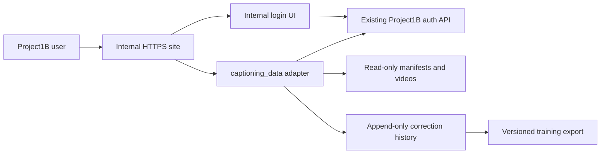

# Using captioning_data with Project1B

## 1. What is integrated

The internal site provides:

- `https://internal.project1b.space/`: Project1B login, a captioning_data link, and the admin recording library.
- `https://internal.project1b.space/captioning_data/`: dataset video playback and caption review.

To link from the main Project1B frontend, add a **captioning_data** link to the second URL. This repository serves the route on the internal hostname, not `project1b.space`.



Nginx proxies the existing authentication API at `127.0.0.1:8903`. The caption adapter listens at `127.0.0.1:8326`; it validates the Project1B session on every protected request. Neither upstream should be exposed publicly.

Viewer UI/backend are pinned in `viewer/`; `viewer/SOURCE_SNAPSHOT.json` records the source baseline and file checksums. Installation snapshots imported helpers from the VR-finetune-VLM checkout. Manifests, videos, and account data remain outside this repository.

## 2. Access and sign-in

1. Open `https://internal.project1b.space/captioning_data/` after production installation.
2. If prompted, sign in using an existing, active Project1B account.
3. The internal login UI calls Project1B's real `/api/auth/web/login` endpoint. Successful login returns to captioning_data; sample links retain their sample hash.
4. Choose a sample and inspect its video and captions.

**The internal login page uses Project1B authentication.** Accounts and roles come from the production database, but `__Host-rbt_session` is host-only: users must also sign in on `internal.project1b.space`. There is no shared-session or SSO redirect flow.

If a session expires, keep the editor open. Use **Sign in in another tab**, then **Resume session** and save. Drafts are not durable until Save succeeds and may be lost on refresh or tab closure.

### Current permissions

- Every authenticated Project1B user can view, edit, save, and reset every caption sample.
- `caption_data_reviewer` identifies a caption reviewer in the viewer.
- `caption_data_admin` identifies a caption administrator in the viewer. It does not grant Project1B account-management or recording-library access.
- Existing Project1B `admin` grants still permit account role management and the internal recording library.
- Assignment labels and filters organize workload; they do not enforce access restrictions.

Caption roles share editing permissions because all authenticated users have caption access. There is no separate approval queue or admin-only publish action. Removing a caption role does not revoke caption access; use Project1B account/session controls to revoke access.

## 3. Prepare production

Use the reviewed Project1B backend source checkout for backend changes. Do not patch files directly in a running release directory.

Required infrastructure:

- DNS and HTTPS for `internal.project1b.space`; the existing host's configured target is `211.26.247.72`. Confirm the actual deployment target before changing DNS.
- Nginx, certbot with the server's existing ACME account, systemd, and sudo on the deployment host.
- Python 3.10 or later with the viewer's existing `python-dotenv` dependency. No model server or GPU is required to serve the viewer.
- A VR-finetune-VLM checkout with the existing caption/video helper modules, `data/splits/train.jsonl`, `val.jsonl`, and `test.jsonl`, plus readable video files referenced by the manifests.
- A service user with read access to the manifests and videos, and write access to the correction state directory.
- An operational Project1B authentication API at `127.0.0.1:8903` with the web session/CSRF cookie contract.

On the current development server the example data root is `/home/tho2/VR-finetune-VLM`, Python is `/home/tho2/miniconda3/bin/python3`, and service user is `tho2`. Adjust these for another host. A fresh internal-site checkout still needs that dependency checkout; it does not need uncommitted changes to the dependency's dataset viewer because the reviewed UI/backend ship here.

Back up the Project1B database and existing caption history before release. Database examples use a privately configured PostgreSQL connection service named `project1b`.

## 4. Update the Project1B database and backend

The new role names must be accepted by both PostgreSQL and the main Project1B backend. `deploy/install.sh` does **not** apply this migration or patch the main API.

### Back up and inspect the database

```bash
umask 077
mkdir -p /secure/project1b-backups
pg_dump --dbname='service=project1b' --format=custom \
  --file="/secure/project1b-backups/before-caption-roles-$(date -u +%Y%m%dT%H%M%SZ).dump"

psql 'service=project1b' -X -v ON_ERROR_STOP=1 -c \
  "SELECT pg_get_constraintdef(oid) FROM pg_constraint
   WHERE conrelid = 'user_roles'::regclass AND conname = 'ck_user_roles_role';"
```

If the current constraint already differs from the five-role baseline, reconcile the SQL and patch with that version first. Preserve any additional roles already introduced by another change.

### Patch the backend source

From the main Project1B source checkout, using the path to this repository:

```bash
git apply --check /path/to/project1B_internal/deploy/project1b-caption-roles.patch
git apply /path/to/project1B_internal/deploy/project1b-caption-roles.patch
```

The patch updates:

- `backend/models.py`: the `ck_user_roles_role` model constraint.
- `backend/routers/admin.py`: the `WorkerRole` request allowlist.
- `backend/static/admin.html`: both caption roles in the account role selector.

Commit and test the patch in the main Project1B repository. This internal-site PR does not deploy the companion backend change.

### Apply the database migration, then release the backend

```bash
psql 'service=project1b' -X -v ON_ERROR_STOP=1 \
  -f /path/to/project1B_internal/deploy/caption_data_roles.sql

psql 'service=project1b' -X -v ON_ERROR_STOP=1 -c \
  "SELECT pg_get_constraintdef(oid) FROM pg_constraint
   WHERE conrelid = 'user_roles'::regclass AND conname = 'ck_user_roles_role';"
```

The migration replaces the role constraint transactionally with a five-second lock timeout, preserving users and grants. Production stores role values in `user_roles.role`; it does not need the mock SQLite `roles` catalog.

Apply the database expansion, release the patched backend through Project1B's normal process, then grant the roles. SQL alone leaves the old API rejecting the new names.

No caption table migration is required: captions and before/after history use a durable append-only log outside the application releases.

## 5. Install the internal route

From the reviewed `project1B_internal` checkout on the production host:

```bash
sudo DATASETS_REPO=/home/tho2/VR-finetune-VLM \
  DATASETS_PYTHON=/home/tho2/miniconda3/bin/python3 \
  DATASETS_USER=tho2 \
  bash deploy/install.sh
```

`DATASETS_REPO` selects the VR-finetune-VLM data/helper checkout. Installation copies `viewer/` and snapshots imported helpers. In the installed service, `DATASETS_REPO` points to that code snapshot; `--data-root` selects the actual dataset.

The installer:

1. Copies frontend, adapter, and imported viewer code into `/var/www/project1b-internal/releases/`.
2. Creates or preserves `/var/lib/project1b-datasets/annotation_edits.jsonl` with private permissions.
3. Installs and starts `project1b-datasets.service` as the selected service user.
4. Checks the adapter's local health.
5. Obtains the separate internal-hostname certificate, installs its Nginx site, switches `current`, and reloads Nginx.
6. Verifies the expected HTTPS page is being served. On install failure it restores the previous internal release/configuration/service; correction history is preserved.

First install seeds history from `DATASETS_REPO/data/annotation_edits.jsonl` if present. Inspect it first to exclude mock/development corrections. Redeployment preserves production history.

Verify after installation:

```bash
sudo systemctl status project1b-datasets.service --no-pager
curl --fail http://127.0.0.1:8326/healthz
sudo nginx -t
```

Then test in a browser with an ordinary Project1B account: login, playback, caption save, Before / after, reload, and logout. Confirm recording downloads remain restricted to Project1B `admin` accounts. Run any test edits on a designated QA sample and append a reset when finished; the audit history will retain those operations.

## 6. Assign caption reviewers and administrators

Use an existing Project1B **`admin`** account on the main Project1B site. The internal site's Nginx allowlist intentionally does not expose `/api/admin/...`.

Open the account in Project1B administration, select **Caption data reviewer** or **Caption data admin**, preserve its other roles, and save. The companion patch adds both choices to the selector. The API example below supports scripted assignment.

`PUT /api/admin/workers/{worker_id}/roles` **replaces the complete role set; preserve unrelated grants.** In the main site's browser console, read current roles and add the caption role:

```javascript
const workerId = 'REPLACE_WITH_PROJECT1B_USER_UUID';
const captionRole = 'caption_data_reviewer'; // or 'caption_data_admin'
const detailResponse = await fetch(`/api/admin/workers/${encodeURIComponent(workerId)}`, {
  credentials: 'same-origin', cache: 'no-store'
});
if (!detailResponse.ok) throw new Error(await detailResponse.text());
const account = await detailResponse.json();
const roles = [...new Set([...account.roles, captionRole])];
console.log({ user: account.username, before: account.roles, after: roles });
```

Inspect that output before running the mutation:

```javascript
const csrfCookie = document.cookie.split('; ')
  .find(value => value.startsWith('__Host-rbt_csrf='));
if (!csrfCookie) throw new Error('Sign in with a Project1B web session first');
const roleResponse = await fetch(`/api/admin/workers/${encodeURIComponent(workerId)}/roles`, {
  method: 'PUT', credentials: 'same-origin',
  headers: {
    'Content-Type': 'application/json',
    'X-CSRF-Token': decodeURIComponent(csrfCookie.slice(csrfCookie.indexOf('=') + 1))
  },
  body: JSON.stringify({ roles })
});
if (!roleResponse.ok) throw new Error(await roleResponse.text());
console.log(await roleResponse.json());
```

For removal, reread the current account and replace the `roles` construction with `account.roles.filter(role => role !== captionRole)`, then review and submit the complete set. Coordinate concurrent administrator changes; the API has replacement semantics.

The API audits role changes and revokes the target account's sessions. Ask the user to sign in again on the internal site and check `/api/auth/me`. Direct SQL grants bypass these controls; use the API for ordinary grants and revocations.

Granting `caption_data_admin` does not turn a reviewer into a Project1B `admin`. Keep Project1B account-management authority separate from caption workload labels.

## 7. Assign and reassign videos

Two independent things must be configured:

1. **Account roles** in Project1B authentication determine the viewer's role label.
2. **Sample assignments** in data-root JSON files determine workload labels and filters.

Role changes do not assign videos; assignments do not grant roles. This viewer uses prepared dataset samples and has no assignment-management page.

Files under the configured data root:

```text
data/egoverse/qa/roster.json
data/egoverse/qa/assignment.json
```

Example `roster.json`:

```json
{
  "reviewers": ["Reviewer One", "Reviewer Two"],
  "admins": ["Caption Lead"]
}
```

Example `assignment.json`:

```json
{
  "episodes": {
    "EgoVerse:train:egoverse/example-a": "Reviewer One",
    "EgoVerse:val:egoverse/example-b": "Reviewer Two"
  }
}
```

Use the full viewer **`id`**, including dataset and split, as the assignment key. Obtain valid IDs while signed in on the internal site:

```javascript
const sampleResponse = await fetch('/captioning_data/api/episodes', {
  credentials: 'same-origin', cache: 'no-store'
});
if (!sampleResponse.ok) throw new Error(await sampleResponse.text());
const samples = (await sampleResponse.json()).episodes;
console.table(samples.map(sample => ({
  id: sample.id, dataset: sample.dataset, split: sample.split, assignee: sample.assignee
})));
```

Assignees are display labels, not account IDs. Use unique labels matching Project1B names, update renamed users, and include assignees in the roster for progress reporting. Correction history independently stores authenticated user IDs.

### Create an initial automatic assignment

Create `roster.json` first. From the internal repository checkout, run:

```bash
python3 -B - <<'PY'
from pathlib import Path
from datasets_server import datasets

datasets.REPO = Path('/home/tho2/VR-finetune-VLM')
qa = datasets.REPO / datasets.QA_DIR
roster = datasets.read_json(qa / 'roster.json', {'reviewers': [], 'admins': []})
datasets.write_assignment(qa / 'assignment.json', datasets.load(datasets.SOURCES), roster)
PY
```

The helper assigns **EgoVerse only** using a deterministic shuffle: reviewers get two seats per round, administrators one. It refuses to overwrite assignments. Add reviewers by updating selected entries; assign other datasets explicitly in the same `episodes` map.

### Reassign selected samples

Back up both JSON files. Then use an atomic update; this example preserves unrelated assignments:

```bash
python3 -B - <<'PY'
import json
from pathlib import Path
from datasets_server import datasets

datasets.REPO = Path('/home/tho2/VR-finetune-VLM')
qa = datasets.REPO / datasets.QA_DIR
assignment = qa / 'assignment.json'
roster = datasets.read_json(qa / 'roster.json', {'reviewers': [], 'admins': []})
known_people = set(roster['reviewers'] + roster['admins'])
known_ids = {sample['id'] for sample in datasets.load(datasets.SOURCES)}
changes = {'REPLACE_WITH_EXACT_VIEWER_ID': 'Reviewer Two'}
assert set(changes) <= known_ids, 'Unknown sample ID'
assert set(changes.values()) <= known_people, 'Assignee missing from roster'
document = json.loads(assignment.read_text())
document.setdefault('episodes', {}).update(changes)
temporary = assignment.with_suffix('.json.next')
temporary.write_text(json.dumps(document, indent=2) + '\n')
temporary.replace(assignment)
PY

sudo systemctl restart project1b-datasets.service
```

Ask reviewers to save drafts before restart, then refresh their browsers. Assignments load at startup. Use **QA assignee** or the progress panel to inspect workload; reassignment preserves sample history.

## 8. Review captions and inspect before/after

1. The page starts with **my assigned episodes**. Filter samples by dataset, split, assignee, QA state, or search text; choose **all episodes** to browse beyond your assignments.
   **QA progress** is available to every authenticated user. Expand it to see assigned, corrected, unchanged, remaining, and completion totals per assignee. For `caption_data_reviewer` users, admin assignments are excluded from rows and totals. Admins see all assignments. Click an assignee's row to view their episodes.
2. Select a sample. Play the video and inspect instruction, sub-task, and atomic captions.
   Caption controls, video size, and speed sit above the video; editing and save actions sit below it. Selected annotation stays visible directly above the timeline; crop and review-reason fields sit below it.
   Drag the video captions to move the block within the frame; its position is remembered in this browser. Double-click to reset. When focused, arrow keys move it and **Home** resets it. Position also adapts to video resizing and the **F** fullscreen shortcut.
   **Caption Settings** contains caption size (50–200%), box width (20–100% of the video region), and background opacity (0–100%). Text wraps within the box; settings are remembered in this browser.
3. Edit caption text and cue timing. Use the existing add/remove controls where needed.
   **Hide Qwen suggestions** hides check notes and suggestion controls in the selected annotation and caption table. **Show Qwen suggestions** restores them. This preference persists in the browser; captions and saved corrections are unchanged.
   **Flag for Review** opens a required reason field. Describe what needs another inspection, then **Save** to persist the flag and reason. **Remove Review Flag** clears both. Flags appear in the **flagged for review** flag filter, independently of normal **corrected** or **saved unchanged** QA status and completion totals.
   Expand **Crop video** below the timeline. Set start/end from the playhead or enter times; shaded regions are excluded. **Preview crop** limits playback to the retained range; turn it off to inspect outside that range. **Clear crop** restores the full video. Crop changes support undo/discard and persist with **Save**.
4. Click **Before / after** to inspect changes beside the video (below it on narrow screens). The panel starts hidden for each episode and scrolls independently on wide screens. Default comparison is original versus current saved captions or unsaved draft.
5. Inspect removed words, added words, timing changes, and added/removed cues. **Show unchanged captions** includes the untouched parts. Timestamp buttons seek the video to either version's cue.
6. Click **Save** and wait for success. The next episode in the current filtered list opens automatically; saving the last episode stays there. Failed saves keep the current episode and draft. Saved revisions remain available when you reopen the episode.

Keyboard shortcuts (outside text/time fields): **Space** pauses/resumes video. In Edit mode, **E** trims the caption at the playhead to end there; **P** extends the preceding caption to the playhead, moving the current caption's start when needed to prevent overlap. Both use the current caption's level, keep at least 0.1 s per caption, and support **Ctrl/Cmd+Z** undo. **C** splits a caption into two. **E** follows the **move shared boundaries** setting; **P** moves the next start whenever needed. Changes remain drafts until saved.

**Enter** pauses playback, enables Edit mode if needed, and focuses the selected annotation caption. **Up** moves that editor from atomic to sub-task to instruction, skipping missing sub-tasks. Instruction text is editable. **Enter/Escape** leaves the text field; seeking or resuming playback restores the caption at the playhead. Up/Down in table time fields still adjusts timing.

Save without semantic changes marks a sample **confirmed**; a changed save marks it **corrected**. These are QA states, not separate administrator approvals.
Before/after history includes flags, reasons, and crop ranges. Reset restores original captions, removes the crop and review flag, and retains saved revisions.

Crops are reversible time selections, not rewritten video files. Training exports preserve the source video, duration, and caption timestamps, adding `video_crop: {start, end}` with `video_crop_timestamp_origin: "episode"`. A training consumer must apply these bounds to the existing episode clip, intersect captions with the retained range, and subtract the crop start when creating a cropped sample. Exclude rows with `review_flag: true` (`training_ready: false`) until their flag is cleared.

Select saved versions to inspect reviewer changes. **Before selected change** uses the state that reviewer started from; **Original captions** uses that revision's baseline. Editor and save time identify revisions. Comparison is read-only and does not restore the selected version into the editor.

**Discard** drops unsaved changes and restores the last saved state. **Reset** appends a revert to original captions and keeps prior versions. To restore an earlier correction, inspect it, reapply the content, and save a new version.

Concurrent saves return `409` rather than overwriting another reviewer's work. Preserve your intended text, reopen the sample to load its current version, reconcile the changes, then save. On mobile, opening comparison hides the episode list and stacks Before/After; use **☰ episodes** to reopen the list.

## 9. Safe storage and training export

Production correction history is:

```text
/var/lib/project1b-datasets/annotation_edits.jsonl
```

Each new save/reset records sample ID, source manifest, UTC time, version, authenticated editor ID/name/roles, source SHA-256, original captions, and immediately preceding captions. Saves include the complete corrected fields. The server appends and `fsync`s the log and its directory before reporting success. It holds one writer-process lock and serializes request writes. Reset retains old revisions.

Synced writes do not replace backups against disk loss. Schedule snapshots and copy verified packages to separate storage; this PR installs no backup schedule.

### Export a durable snapshot

Run as the service user with history read access and backup-directory write access:

```bash
snapshot_name="production-$(date -u +%Y%m%dT%H%M%SZ)"
sudo -u tho2 env DATASETS_REPO=/var/www/project1b-internal/current/service \
  /home/tho2/miniconda3/bin/python3 -B \
  /var/www/project1b-internal/current/datasets_server.py \
  --data-root /home/tho2/VR-finetune-VLM \
  --edits /var/lib/project1b-datasets/annotation_edits.jsonl \
  --export "/mnt/SSD5/captioning_data-snapshots/$snapshot_name"
```

Export requires a new destination. It captures committed history under a file lock, copies manifests into a private temporary package, applies active corrections, syncs files, and publishes atomically. Corrupt history and source drift cause export to fail.

The package contains:

- `data/splits/train.jsonl`, `val.jsonl`, `test.jsonl`: full manifests with active corrections applied.
- `annotation_edits.jsonl`: the complete captured audit history, including resets.
- `snapshot.json`: creation time, source hashes, exported-file hashes, history count, and legacy records without source hashes.

Changed rows include `before_edit`, `edited_by`, `edited_by_id`, `edited_at`, and `edit_version`. Reset samples use source captions. Exports include unchanged samples; check QA coverage and split policy before training. Videos are referenced, not copied.

Verify all output hashes before copying the package or training:

```bash
python3 -B - /path/to/exported-snapshot <<'PY'
import hashlib, json, sys
from pathlib import Path
root = Path(sys.argv[1])
metadata = json.loads((root / 'snapshot.json').read_text())
for relative, expected in metadata['file_sha256'].items():
    actual = hashlib.sha256((root / relative).read_bytes()).hexdigest()
    assert actual == expected, relative
print('Snapshot checksums verified')
PY
```

Train from exported manifests and retain the package plus accessible video roots. Review legacy records without source hashes/snapshots before training; `snapshot.json` reports the hashless count.

## 10. Add or update source videos

Project1B uploads do not automatically appear in captioning_data. Prepare the video and manifest row through the data pipeline, then add it to the appropriate split.

Rows provide `episode_uid`, `dataset`, `split`, `video`, `duration_s`, `instruction`, `subtask`, and `caption` in supported formats. Keep IDs unique/stable, video paths readable by the service user, and cue times aligned with the sample video. Reassignment does not change source videos.

The adapter loads manifests at startup and pins each file's SHA-256. Any row change changes that hash. Active corrections against the old file cause startup/export to fail, preventing silent application to a new baseline.

Before replacing source manifests or videos:

1. Pause reviewer work and export a verified snapshot against the existing sources.
2. Keep a backup of the original manifests and referenced videos.
3. Plan a new immutable dataset batch and separate correction history, or explicitly reconcile existing corrections through a reviewed migration. The installer does not perform that migration.
4. Validate sample IDs, caption timing, playable video paths, and updated assignment keys.
5. Update the configured data root/history as required, restart the service, and verify the browser and export.

Do not clear history or bypass source validation. Stored original/before snapshots preserve comparisons; applying old corrections to new sources still requires reconciliation.

Custom source manifests can be served by the adapter's repeated `--source DATASET=MANIFEST` options. The installer configures the three standard split files; a custom-source systemd setup needs corresponding reviewed arguments and matching arguments on every export. Avoid one-off service changes that a later installer run would overwrite.

## 11. Operate, update, and recover

```bash
sudo journalctl -u project1b-datasets.service -n 100 --no-pager
sudo systemctl restart project1b-datasets.service
sudo systemctl stop project1b-datasets.service
```

For updates, export/backup, check out the reviewed code, and rerun the installer with the same data/Python/user settings. Correction history is preserved.

For rollback, restore the matching release and systemd unit together: the unit pins viewer imports. Validate Nginx, restart the adapter, and reload Nginx. Preserve current correction history.

For storage recovery, stop the adapter, privately copy the damaged log/lock files, inspect committed records and backups, then repair deliberately. Restart and verify replay/export. A failed append blocks further writes until restart; inspect the log before retrying.

Troubleshooting:

- Login rejected: confirm the account is active, password is correct, and the real auth API is available. Mock usernames only work in local preview.
- `401`: session expired or revoked; sign in on the internal hostname.
- `403` on save: check exact HTTPS origin and valid same-host CSRF cookie/session.
- `409`: another revision won; reload and reconcile before retrying.
- `503`: inspect auth availability and adapter storage errors.
- Role API `422`: backend allowlist patch is missing or the role spelling is wrong.
- Database check failure: the seven-role migration is missing or a different constraint needs reconciliation.
- Blank video: check the manifest path/remapping and service-user filesystem access.
- Assignment missing: use exact viewer IDs, add assignee to roster, restart adapter, then refresh.
- Source-changed error: restore the pinned manifest or use the planned dataset migration; retain history.
- Second writer cannot start: an existing adapter holds the singleton lock; identify and stop it before starting another against that history.

## 12. Local QA without production accounts

Run a local preview from this repository:

```bash
python3 -B local_preview.py \
  --data-root /home/tho2/VR-finetune-VLM \
  --host 100.89.98.89
```

Open `https://100.89.98.89:9445/captioning_data/` from a device able to reach that server address. Accept the local self-signed certificate prompt. Fictional accounts are `admin`, `worker`, `caption_manager`, `caption_data_admin`, and `caption_data_reviewer`; all use `preview-password`.

Mock authentication uses `.preview/mock.sqlite3`; corrections use `.preview/edits.jsonl`. Stop with Ctrl+C in its terminal, or send SIGTERM to the verified launcher PID in `.preview/preview.pid`. The launcher shuts down its own Nginx/API/adapter. Keep the state directory to retain mock users and edits. Do not apply production PostgreSQL SQL to SQLite or point the mock server at production history.

### Runnable checks

From this repository:

```bash
node tests/save-navigation.cjs
DATASETS_REPO=/home/tho2/VR-finetune-VLM python3 -B tests/storage.py

npm install --prefix /tmp/project1b-qa playwright
/tmp/project1b-qa/node_modules/.bin/playwright install chromium
DATASETS_REPO=/home/tho2/VR-finetune-VLM \
NODE_PATH=/tmp/project1b-qa/node_modules node tests/smoke.cjs
```

Storage checks cover revision snapshots, replay, locked exports, checksums, source drift/corruption rejection, and mock roles. Smoke checks use temporary fixture data, packaged code, local Nginx, and a fake auth API; they do not contact production.

`tests/preview.cjs` checks a running mock with local videos, comparisons, and mobile layout. It appends audit entries and restores prior captions unless a concurrent edit intervened. Run only against the local mock:

```bash
PREVIEW_URL=https://100.89.98.89:9445 \
NODE_PATH=/tmp/project1b-qa/node_modules node tests/preview.cjs
```
